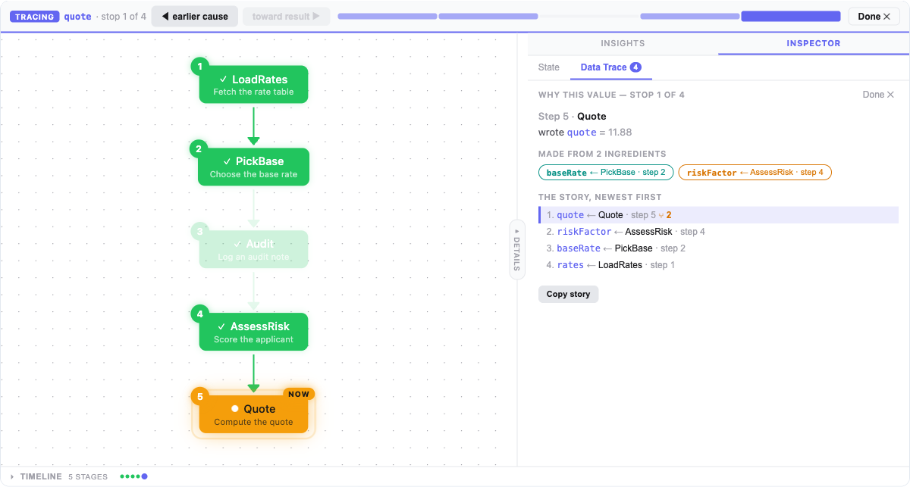
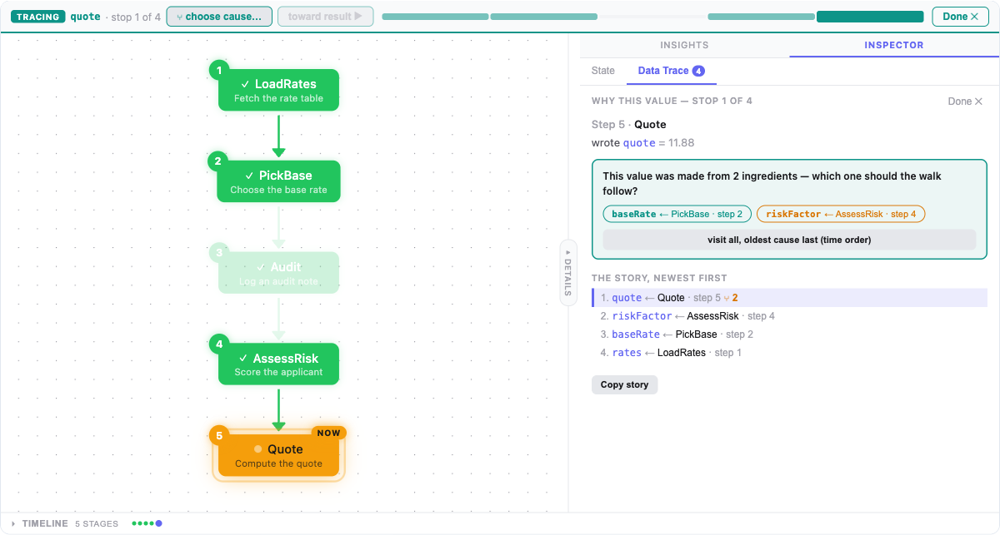

# footprint-explainable-ui

<p>
  <a href="https://www.npmjs.com/package/footprint-explainable-ui"></a>
  <!-- coverage-badge --><!-- /coverage-badge -->
  <a href="https://github.com/footprintjs/explainable-ui/blob/main/LICENSE"></a>
  <a href="https://footprintjs.github.io/footprint-demo/"></a>
  <a href="https://footprintjs.github.io/footprint-playground/"></a>
</p>

Themeable React components for visualizing [footprintjs](https://github.com/footprintjs/footPrint) pipeline execution — time-travel debugging, flowchart overlays, subflow drill-down, and collapsible detail panels.

> Part of the **[footprintjs ecosystem](https://footprintjs.github.io/)** — the self-explaining stack.

## Install

```bash
npm install footprint-explainable-ui
```

**Peer dependencies:** `react >= 18`, `react-dom >= 18`

For flowchart components, also install:

```bash
npm install @xyflow/react
```

## Entry Points

| Import path | What it provides |
|---|---|
| `footprint-explainable-ui` | Core components, themes, adapters |
| `footprint-explainable-ui/flowchart` | Flowchart visualization (requires `@xyflow/react`) |

## Quick Start

### 1. Capture the chart while it is built

The chart is the one thing a run does not leave behind, so collect it at BUILD
time (or save `chart.buildTimeStructure` — see step 3):

```typescript
import { flowChart, FlowChartExecutor } from "footprintjs";
import { createTraceStructureRecorder } from "footprint-explainable-ui/flowchart";

const trace = createTraceStructureRecorder();
const chart = flowChart("seed", seedFn, "seed", { structureRecorders: [trace.recorder] })
  .addFunction("work", workFn, "work")
  .build();

const executor = new FlowChartExecutor(chart);
await executor.run({ input: data });
```

### 2. Render with the all-in-one shell

```tsx
import { ExplainableShell } from "footprint-explainable-ui";

<ExplainableShell
  runtimeSnapshot={executor.getSnapshot()}
  traceGraph={trace.getGraph()}
  title="My Pipeline"
  panelLabels={{ topology: "What Ran", details: "What Happened", timeline: "How Long" }}
/>;
```

Two props. The shell converts the snapshot into rows, reads the story out of the
recorders that rode along inside it, and lights the executed path from the
commit log. Already have `StageSnapshot[]` from `toVisualizationSnapshots()`?
Pass them as `snapshots` instead.

This gives you:
- **Flowchart** (center) — execution path overlay, click subflow nodes to drill-down
- **Topology panel** (left) — subflow tree navigator, collapsible via VLinePill handle
- **Details panel** (right) — Memory state + Narrative tabs, collapsible
- **Timeline** (bottom) — Gantt-style stage durations, collapsible
- **Time-travel slider** — scrub through execution steps
- **Breadcrumbs** — navigate back from subflow drill-down
- **Mobile responsive** — auto-stacks vertically below 640px

### 3. Replaying a recording (no live executor)

**A recording is three things.** Save all three together — miss one and one
surface goes dark:

```ts
const recording = {
  snapshot:  executor.getSnapshot(),     // memory, story, timeline, chart colouring
  structure: chart.buildTimeStructure,   // THE CHART. Nothing else can draw it.
  events:    myEventLog,                 // the agent view (agentfootprint-lens)
};
fs.writeFileSync("run.json", JSON.stringify(recording));
```

`structure` is the piece a run does not leave behind on its own: `getSnapshot()`
never contains it, and no adapter can invent it. Rendering is two props:

```tsx
import { ExplainableShell, graphFromStructure } from "footprint-explainable-ui";

const run = JSON.parse(await fs.readFile("run.json", "utf8"));

<ExplainableShell
  runtimeSnapshot={run.snapshot}
  traceGraph={graphFromStructure(run.structure)}
  traceTheme={{ mode: "light" }}
/>;
```

You do **not** pass a `runtimeOverlay`: the chart's colouring is rebuilt from the
snapshot's own commit log. Pass one only when you have a live
`createTraceRuntimeOverlay` handle. The narrative comes along too — if the run
was recorded with footprintjs's narrative recorder the shell reads the story out
of `snapshot.recorders`, so `narrativeEntries` is only for overriding it.

Runnable, with a generator that records a real run:
[`examples/replay-a-recording/`](./examples/replay-a-recording/) —
`npm run example:record && npm run example:replay`.

Already have the file? `<TraceViewer recording={run} onError={...} />` is the
same composition in one component.

**What a recording honestly cannot show** — each is stated on screen, never
faked: per-stage durations without footprintjs's `metrics()` recorder (the Gantt
shows execution ORDER and says so), error messages (the commit log has no error
channel — a failing stage's writes land, its message does not), and deep subflow
internals (footprintjs keeps those out of the run-level commit log, so a replay
lights the mount stages, not their insides).

### 4. Or compose individual components

```tsx
import {
  TimeTravelControls,
  MemoryInspector,
  ScopeDiff,
  GanttTimeline,
  NarrativeTrace,
} from "footprint-explainable-ui";

function MyDebugger({ snapshots }) {
  const [idx, setIdx] = useState(0);
  const current = snapshots[idx];
  const previous = idx > 0 ? snapshots[idx - 1] : null;

  return (
    <>
      <TimeTravelControls
        snapshots={snapshots}
        selectedIndex={idx}
        onIndexChange={setIdx}
      />
      <MemoryInspector snapshots={snapshots} selectedIndex={idx} />
      <ScopeDiff
        previous={previous?.memory ?? null}
        current={current.memory}
        hideUnchanged
      />
      <NarrativeTrace narrative={snapshots.map(s => s.narrative)} />
      <GanttTimeline snapshots={snapshots} selectedIndex={idx} onSelect={setIdx} />
    </>
  );
}
```

---

## ExplainableShell

The all-in-one orchestrator. Handles time-travel, subflow drill-down, memory/narrative panels, and responsive layout.

### Props

Pass the run one of two ways — `runtimeSnapshot` (the shell converts it) or
pre-converted `snapshots`. Both are optional; pass neither and the shell says
what it wanted instead of rendering empty chrome.

| Prop | Type | Default | Description |
|---|---|---|---|
| `runtimeSnapshot` | `RuntimeSnapshotInput \| null` | — | A recorded `executor.getSnapshot()`. Drives the rows, memory, story, provenance, recorder tabs — and the chart's colouring |
| `snapshots` | `StageSnapshot[]` | — | Pre-converted rows, when you called `toVisualizationSnapshots()` yourself. Wins over `runtimeSnapshot` |
| `traceGraph` | `TraceGraph \| null` | — | The chart. From `createTraceStructureRecorder()` live, or `graphFromStructure(saved.structure)` for a recording. **No chart without it** |
| `runtimeOverlay` | `RuntimeOverlay \| null` | derived from `runtimeSnapshot` | The executed-path colouring. Usually omit — pass one only for a live `createTraceRuntimeOverlay` handle |
| `traceTheme` | `TraceTheme` | — | `{ mode: "light" \| "dark" }` re-themes the whole shell in one word; `visited` / `current` override the two node colours |
| `narrativeEntries` | `NarrativeEntry[]` | read from the snapshot | Structured narrative. Only needed to override the story the recording carries |
| `title` | `string` | `"Flowchart"` | Breadcrumb root label |
| `resultData` | `Record<string, unknown>` | `snapshot.sharedState` | Final output shown on the Result tab |
| `logs` | `string[]` | `[]` | Console lines shown under the result |
| `tabs` | `ShellTab[]` | `["result", "explainable"]` | Top-level views |
| `defaultTab` | `ShellTab` | first available | Which details tab opens first |
| `hideTabs` | `string[]` | — | Details tabs to hide by id (e.g. `["result", "memory"]`) |
| `hideConsole` | `boolean` | `false` | Hide the console block on the Result tab |
| `recorderViews` | `RecorderView[]` | auto-detected | Extra details tabs. Recorders inside the snapshot already get one each |
| `panelLabels` | `PanelLabels` | `{ topology: "Topology", details: "Details", timeline: "Timeline" }` | Collapsible pill labels |
| `defaultExpanded` | `DefaultExpanded` | `{ details: true }` | Which panels start open |
| `renderFlowchart` | `(props) => ReactNode` | `<TracedFlow>` | Replace the chart renderer. Still requires `traceGraph` |
| `showStageId` | `boolean` | `false` | Print each node's stable `stageId` under its label (teaching aid) |
| `size` | `"compact" \| "default" \| "detailed"` | `"default"` | Size variant |
| `unstyled` | `boolean` | `false` | Strip styles, render `data-fp` attributes |

### Tracing a value — walk the timeline backward through its causes



Open **Inspector → Data Trace** and click one of the "Trace a value" chips.
The time slider stays the same rail — the stages that made that value light
up as **stops**, everything else fades to unlandable ticks, and the buttons
become **◀ earlier cause / toward result ▶**. This works because every
ingredient of a value was always written *earlier in the run* than the value
it fed, so the dependency chain is a sub-sequence of the timeline you already
have. One cursor, no new axis.

- A value made from **two ingredients** shows both as colored chips —
  pressing "earlier cause" visits both (most recent first); nothing is ever
  silently skipped. Click a chip to **follow** just that ingredient (the
  breadcrumb shows `key ▸ via ingredient · show all`).
- Every stop shows the world **as it was at that moment** — the state panel
  time-travels with the walk for free.
- **Honest absence**: a value nobody wrote gets a truthful card ("never
  written in this run — it arrived with the run's inputs"), and a value not
  written *yet* at the cursor's moment says exactly that, naming where its
  first write happens. Reads-off runs say "unknowable, not absent".
- **[Copy story]** emits the same text an LLM backtrack tool returns — the
  human's board and the agent's answer are one artifact.
- Tracing lives on the root rail: drilling into a subflow exits it honestly.
- **Trace anything**: below the current step's chips, a search box lists
  *every* variable the run ever wrote — trace any of them from wherever you
  stand.
- **Forks ask, never assume**: at a value made from two or more ingredients
  the walk-back button becomes **⑂ choose cause…** and asks which ingredient
  to follow (or "visit all, in time order"). Nothing is ever silently picked.



- **Unmistakable mode**: the whole tracing rail wears its own color
  (`--fp-tracing`, teal by default — themeable) so tracing can never be
  confused with normal time-travel.

### Panel Labels

Customize the text on collapsible pill buttons. Semantic keys — not tied to position:

```tsx
<ExplainableShell
  panelLabels={{
    topology: "What Ran",      // left panel (subflow tree)
    details: "What Happened",  // right panel (memory/narrative)
    timeline: "How Long",      // bottom panel (Gantt)
  }}
/>
```

### Default Expanded

Control which panels start open. Desktop default: details panel open (flowchart + memory = the library's unique value). For mobile, pass all `false`:

```tsx
// Desktop (default) — memory panel open
<ExplainableShell snapshots={...} traceGraph={...} runtimeOverlay={...} />

// Mobile — all collapsed, flowchart fills screen
<ExplainableShell
  snapshots={...}
  defaultExpanded={{ details: false }}
/>

// Everything open
<ExplainableShell
  snapshots={...}
  defaultExpanded={{ topology: true, details: true, timeline: true }}
/>
```

### Responsive Layout

The shell auto-detects container width via `ResizeObserver`:

- **Desktop (≥640px):** 3-column layout — SubflowTree | Flowchart | Memory/Narrative. Side panels collapse to VLinePill handles.
- **Mobile (<640px):** Stacked vertical — Flowchart (350px) → collapsible HLinePill sections. All panels auto-collapse on narrow.

### Collapsible Panel UX

All panels use the **line + pill** pattern:
- **Collapsed:** Thin divider line with a centered pill button (label + arrow)
- **Expanded:** Full content with a pill handle on the closing edge
- **VLinePill** (left/right panels): Vertical line with centered vertical pill. `side` prop controls arrow direction.
- **HLinePill** (bottom timeline): Horizontal line with centered pill.

---

## Flowchart Visualization

Import from `footprint-explainable-ui/flowchart`. The chart is recorder-driven:
a `TraceGraph` says what the chart IS, a `RuntimeOverlay` says what ran.

### TracedFlow — the chart plus the run

```tsx
import { TracedFlow } from "footprint-explainable-ui/flowchart";

<div style={{ height: 400 }}>
  <TracedFlow
    graph={trace.getGraph()}       // from createTraceStructureRecorder
    overlay={overlayFromSnapshot(snapshot)}   // or a live createTraceRuntimeOverlay
    scrubIndex={idx}
    theme="light"
    onNodeClick={(stageId) => handleClick(stageId)}
  />
</div>
```

Without an `overlay` it renders the plain build-time chart. With one, the
executed path lights up, un-run stages fade, and each executed node carries its
step number. Subflow mount nodes drill on click, and the chart re-fits itself
whenever its container resizes.

### Where the graph comes from

| You have | Call | Notes |
|---|---|---|
| a live build | `createTraceStructureRecorder()` → `flowChart(..., { structureRecorders: [rec] })` | collects the chart AS it is built |
| a saved run | `graphFromStructure(saved.structure)` | `saved.structure` is `chart.buildTimeStructure` |

Both produce the same `TraceGraph`, with the same node ids — which is what lets
either overlay light the right boxes.

---

## Theming

**Every default in this library is dark.** Dropped into a light app with nothing
set, a panel renders dark — correct by the rules, wrong on the page. There are
three ways to fix that, smallest first.

### 1. One word, per component

```tsx
<ExplainableShell traceTheme={{ mode: "light" }} />   {/* the shell */}
<TraceViewer theme="light" />                          {/* the standalone components */}
<SnapshotPanel theme="light" />
<GanttTimeline theme="light" />
<TracedFlow theme="light" />
```

`theme` stamps a full built-in preset as `--fp-*` variables on that component's
own root, so everything under it follows. It is the whole theme wiring for an
app that just wants light.

### 2. Follow the app's own dark mode — `useDarkModeTokens`

The direct answer to "why is your UI dark inside my light app". The hook watches
your app's dark-mode switch and hands back the matching preset:

```tsx
import { FootprintTheme, useDarkModeTokens } from "footprint-explainable-ui";

function MyApp() {
  const tokens = useDarkModeTokens();              // Tailwind's `.dark` on <html>
  return (
    <FootprintTheme tokens={tokens}>
      <ExplainableShell runtimeSnapshot={snapshot} traceGraph={graph} />
    </FootprintTheme>
  );
}
```

Whatever switch your app uses, name it:

```tsx
useDarkModeTokens({ darkClass: "theme-dark" })            // a class name
useDarkModeTokens({ darkClass: '[data-theme="dark"]' })   // any CSS selector
useDarkModeTokens({ light: warmLight, dark: warmDark })   // your own palettes
```

It re-themes live when the switch flips, and it is server-safe: on the server
there is no `document`, so the first render is light and the client corrects on
mount.

### 3. CSS variables (full control)

Consumer controls theme via `--fp-*` CSS custom properties. Components use `var(--fp-*, fallback)`:

```css
:root {
  --fp-color-primary: #7c6cf0;
  --fp-accent: #7c6cf0;             /* active tab / selected rule */
  --fp-accent-bg: rgba(124,108,240,0.14); /* wash behind a selected row */
  --fp-bg: #1e1a2e;                 /* panel body surface */
  --fp-bg-elevated: #2a2540;        /* raised cards on that surface */
  --fp-bg-primary: #1e1a2e;
  --fp-bg-secondary: #2a2540;
  --fp-bg-tertiary: #3a3455;
  --fp-text-primary: #f0e6d6;
  --fp-text-secondary: #b0a898;
  --fp-text-muted: #6b6b80;
  --fp-border: #3a3455;
  --fp-tracing: #3ecfb2;            /* the "walking a value's causes" rail */
  --fp-chip-1: #0d9488;             /* the four ingredient-chip hues (categorical) */
  --fp-chip-2: #d97706;
  --fp-chip-3: #7c3aed;
  --fp-chip-4: #e11d48;
  --fp-radius: 8px;
  --fp-font-sans: 'Inter', system-ui, sans-serif;
  --fp-font-mono: 'JetBrains Mono', monospace;
}
```

Every built-in preset sets all of these, so one `mode` re-themes the whole shell
— no component is left on a hard-coded dark default. `test/unit/themeTokens.test.ts`
enforces both halves of that: every `--fp-*` a component reads must be emitted by
every preset, and no component may paint a raw colour the theme cannot reach.

### ThemeProvider

```tsx
import { FootprintTheme, warmDark } from "footprint-explainable-ui";

<FootprintTheme tokens={warmDark}>
  <MyApp />
</FootprintTheme>
```

### Built-in Presets

| Preset | Description |
|---|---|
| `coolDark` | Default — indigo/slate dark theme |
| `warmDark` | Charcoal-purple with warm text |
| `warmLight` | Cream/peach light theme |
| `coolLight` | Light indigo theme |

---

## Components Reference

### Core Components

| Component | Description |
|---|---|
| `ExplainableShell` | All-in-one orchestrator with collapsible panels and responsive layout |
| `TimeTravelControls` | Play/pause, prev/next, scrubber timeline |
| `MemoryPanel` | Memory state + scope diff (composite right-panel view) |
| `NarrativePanel` | Narrative trace with progressive reveal |
| `StoryNarrative` | Rich rendering of structured `NarrativeEntry[]` |
| `NarrativeTrace` | Collapsible stage groups with progressive reveal |
| `NarrativeLog` | Simple timeline-style execution log |
| `ScopeDiff` | Side-by-side scope changes (added/changed/removed) |
| `ResultPanel` | Final pipeline output + console logs |
| `MemoryInspector` | Accumulated memory state viewer |
| `GanttTimeline` | Horizontal duration timeline (collapsible) |
| `SnapshotPanel` | All-in-one inspector (scrubber + memory + narrative + Gantt) |
| `TraceViewer` | Renders a saved `{ snapshot, structure }` recording — parse, diagnose, draw |

### Flowchart Components (`footprint-explainable-ui/flowchart`)

| Export | Description |
|---|---|
| `TracedFlow` | The chart plus the run — overlay colouring, drill-down, auto-fitView |
| `TraceFlow` | Build-time chart only (no overlay) |
| `createTraceStructureRecorder` | Collect the `TraceGraph` while footprintjs builds the chart |
| `graphFromStructure` | The same graph from a SAVED `chart.buildTimeStructure` |
| `createTraceRuntimeOverlay` | Collect the `RuntimeOverlay` from a live run |
| `overlayFromSnapshot` | The same overlay from a recorded snapshot |
| `StageNode` | Custom node with state-aware coloring, step badges, pulse rings |
| `SubflowBreadcrumb` | Breadcrumb bar for subflow drill-down |
| `SubflowTree` | Tree view of all subflows (used in shell's left panel) |
| `dagreTraceLayout` | The default structure-derived layout |

### Adapters

| Export | Description |
|---|---|
| `toVisualizationSnapshots` | Convert `FlowChartExecutor.getSnapshot()` → `StageSnapshot[]` |
| `graphFromStructure` | Rebuild the chart's `TraceGraph` from a saved `chart.buildTimeStructure` — the post-hoc twin of `createTraceStructureRecorder` |
| `overlayFromSnapshot` | Rebuild the chart's `RuntimeOverlay` from a recorded snapshot (replay without a live executor) |
| `narrativeFromSnapshot` | Read the narrative a recorded snapshot carries in `snapshot.recorders` |
| `subflowResultToSnapshots` | Convert subflow result → `StageSnapshot[]` |
| `createSnapshots` | Build `StageSnapshot[]` from simple arrays (testing/custom data) |

### Types

| Export | Description |
|---|---|
| `PanelLabels` | `{ topology?, details?, timeline? }` — pill label customization |
| `DefaultExpanded` | `{ topology?, details?, timeline? }` — initial panel state |
| `StageSnapshot` | Core snapshot type for all components |
| `NarrativeEntry` | Structured narrative entry with type/depth/stageName |
| `Recording` | `{ snapshot, structure, events }` — one saved run, read by `<TraceViewer>` and by lens's `observeRecording` |
| `ThemeMode` | `"dark" \| "light"` — the one-word switch |

---

## Size Variants

All components accept a `size` prop: `"compact"`, `"default"`, or `"detailed"`.

```tsx
<GanttTimeline snapshots={snapshots} size="compact" />
<MemoryInspector snapshots={snapshots} size="detailed" />
```

## Unstyled Mode

Strip all built-in styles for full CSS control. Components render semantic `data-fp` attributes:

```tsx
<NarrativeTrace narrative={lines} unstyled className="my-narrative" />
```

```css
[data-fp="narrative-header"] { font-weight: bold; }
[data-fp="narrative-step"] { padding-left: 2rem; }
```

---

## Golden-Trace Fixtures (contributors)

The pipeline (structure/runtime translators, dagre layout, snapshot adapter,
narrative sync) is pinned against **real footprintjs engine output**, not
hand-built mocks. `test/fixtures/golden/` holds recorded traces from 4
representative charts (linear+decider, subflow+loop, parallel fork,
pause/resume); `test/golden/goldenTraces.test.ts` replays them through the full
pipeline and snapshot-asserts the outputs in `test/golden/__snapshots__/`.

- **Engine shape changed** (new footprintjs): `npm i -D --save-exact footprintjs@<version> && npm run fixtures:regen`. The generator runs every chart twice and fails on any nondeterminism.
- **Pipeline output changed intentionally** (eui edit): `npx vitest run test/golden -u`, then review the snapshot diff.
- `test/fixtures/golden/manifest.json` records the footprintjs version the fixtures were recorded with.

`footprintjs` is a devDependency used ONLY by the generator — the published
library still has zero footprintjs dependency (it consumes plain JSON shapes).

## The footprintjs ecosystem

The self-explaining stack — from backend pipelines to AI agents. → **[overview](https://footprintjs.github.io/)**

| Project | Role |
|---|---|
| [footprintjs](https://footprintjs.github.io/footPrint/) | the flowchart pattern (core engine) |
| [agentfootprint](https://footprintjs.github.io/agentfootprint/) | build self-explaining AI agents |
| **Explainable UI** ← you are here | visualize a footprintjs run |
| [Lens](https://github.com/footprintjs/agentfootprint-lens) | debug an agentfootprint run |
| [Thinking UI](https://footprintjs.github.io/agentThinkingUI/) | replay an agent run for non-devs |

---

## License

MIT
